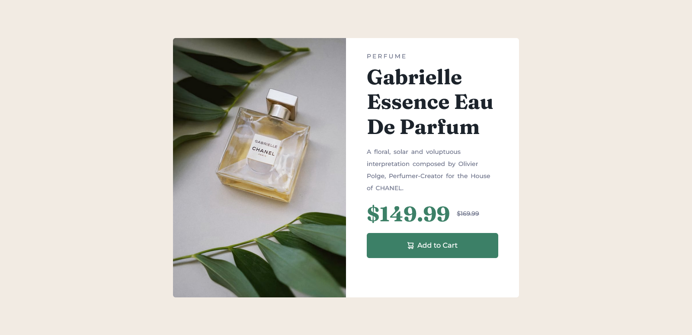
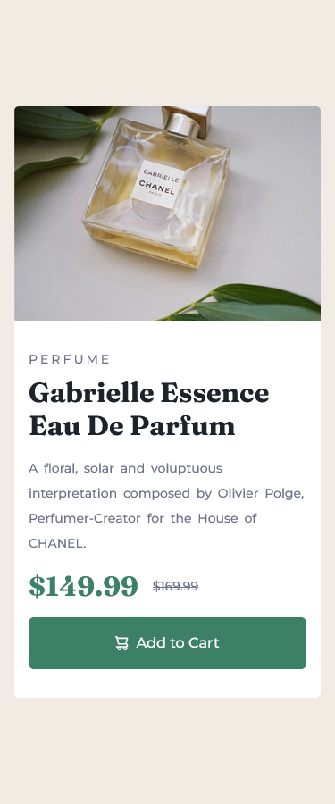

# Frontend Mentor - Product preview card component solution

## Table of contents

- [Overview](#overview)
  - [The challenge](#the-challenge)
  - [Screenshot](#screenshot)
  - [Links](#links)
- [My process](#my-process)
  - [Built with](#built-with)
  - [What I learned](#what-i-learned)
- [Author](#author)
- [Acknowledgments](#acknowledgments)

## Overview

### The challenge

Users should be able to:

- View the optimal layout depending on their device's screen size
- See hover and focus states for interactive elements

### Screenshot

### Links

- Solution URL: [Frontendmentor.io](https://www.frontendmentor.io/solutions/product-preview-card-component-main-build-with-bootstrap-BUxV675rh8)
- Live Site URL: [Live Repository Page](https://mustafaolgun.github.io/product-preview-card-component-main/)

## My process

### Built with

- Semantic HTML5 markup
- CSS custom properties
- Flexbox
- CSS Grid
- Mobile-first workflow
- [Bootstrap](https://getbootstrap.com/) - For Css - Library

### What I learned

  - In this project, I learned the bootstrap library visibility rules for different colon sizes.

  - I learned that the cards take different positions in mobile and dextop widths.

## Author

- Github - [Github](https://github.com/mustafaolgun)
- Codepen - [My Codepen Account](https://codepen.io/mustafaolgun)
- Frontend Mentor - [My Frontendmentor Account](https://www.frontendmentor.io/profile/mustafaolgun)

## Acknowledgments

I aim to develop my intermediate and advanced level of css and then learn Javascript->React-Vue libraries and frameworks. My goal is to learn back-end and become a fullstack developer after improving myself in the front-end part.
